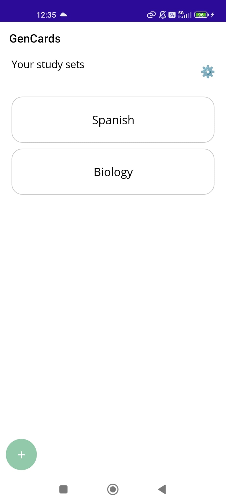
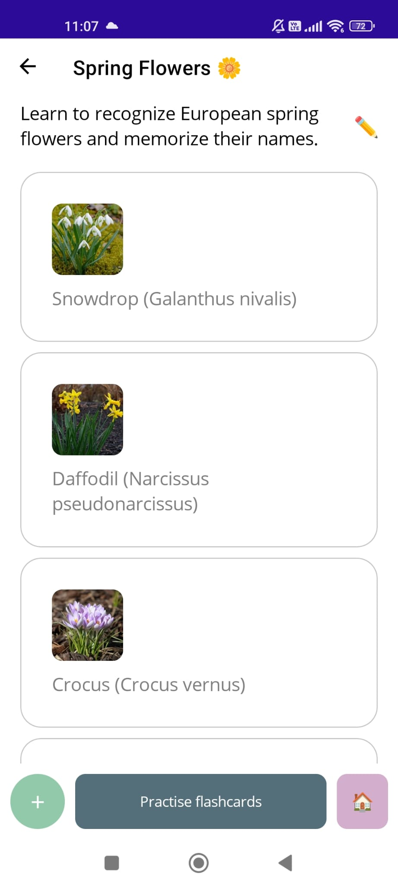
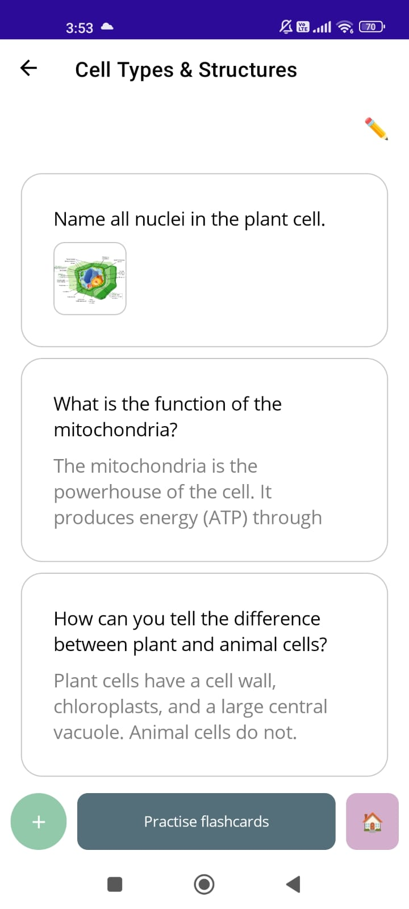
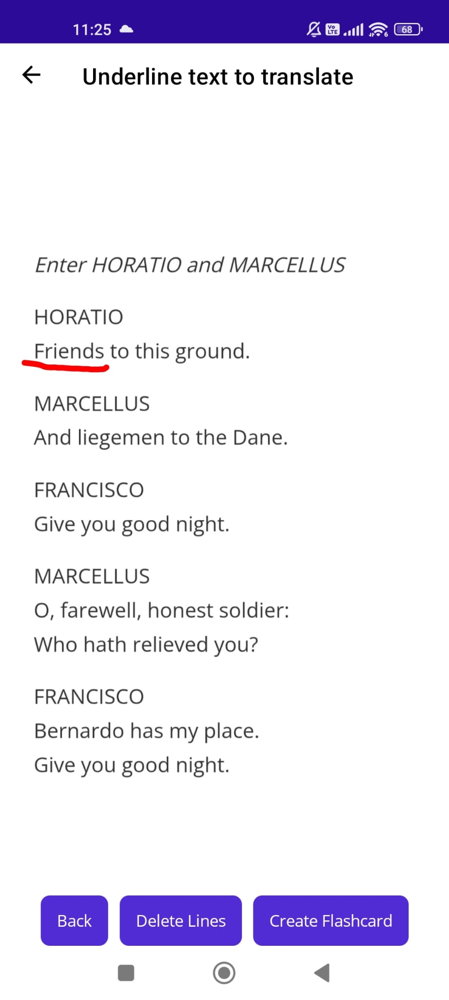
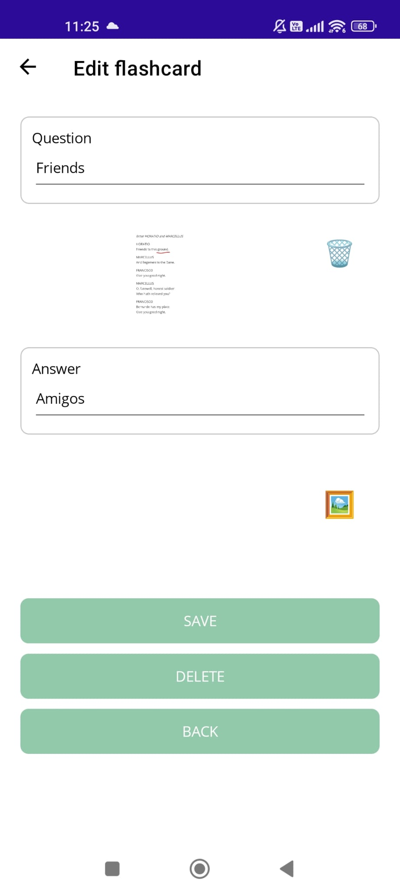
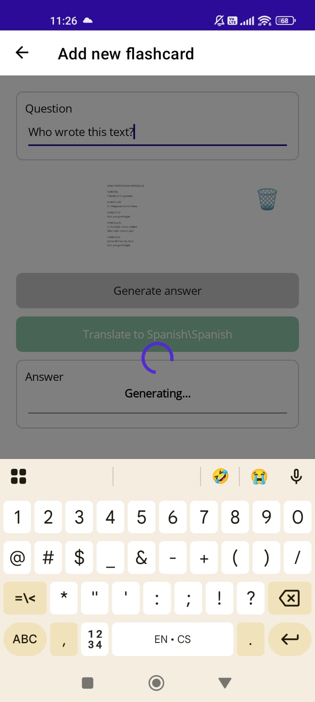
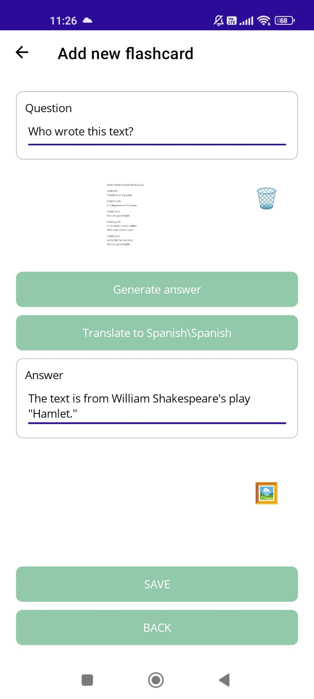
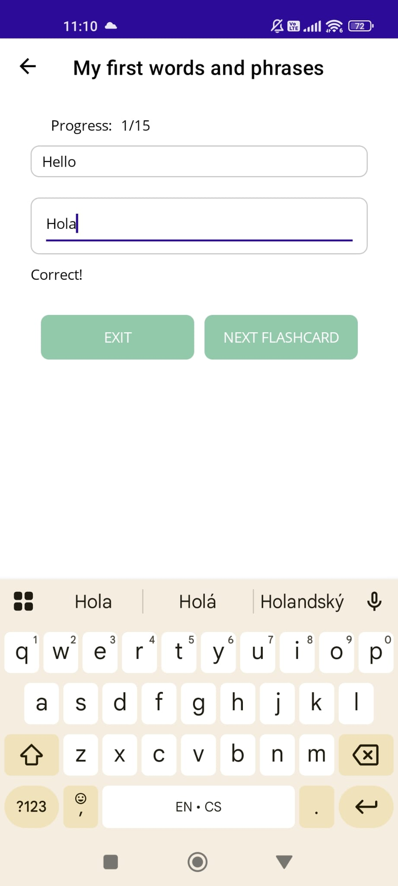
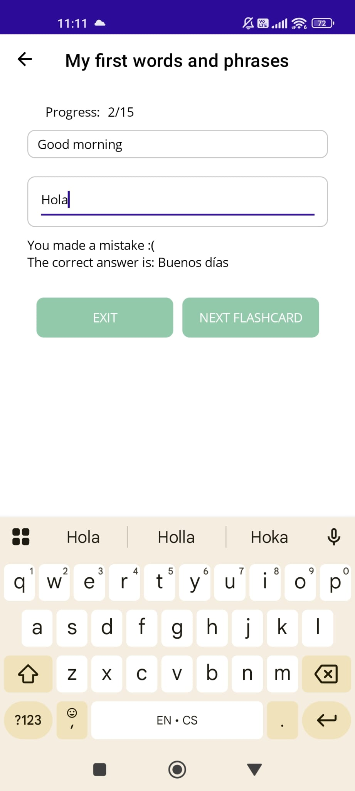
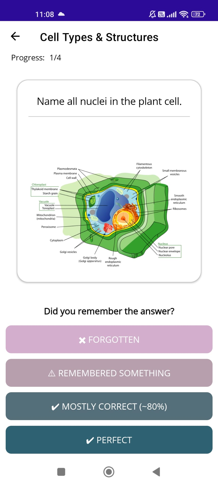

# GenCards 📱🧠

**GenCards** is a cross-platform mobile flashcard app built with .NET MAUI as part of my bachelor thesis.  
It helps users memorize effectively using a custom spaced repetition algorithm, AI-assisted flashcard creation, and support for both text and image-based content.

## 📚 Features

- 🧠 Spaced repetition algorithm inspired by memory decay models  
- ✍️ Create flashcards with text, images, or a combination of both  
- 🤖 AI-assisted flashcard generation using the ChatGPT API  
- 🗂 Organize flashcards into themed study sets and packs  
- 📶 Works fully offline, all data stored locally in JSON  
- 🔄 Shareable flashcard packs (export/import as ZIP)  
- ⚙️ Customizable language and API configuration for automatic flashcard generation

<p>&nbsp;</p>

## 📷 Screenshots

### App overview with custom flashcards
View and manage study sets, browse flashcards, and prepare for review.
<p align="center">
  
  <span>&nbsp;&nbsp;&nbsp;&nbsp;</span>
  
  <span>&nbsp;&nbsp;&nbsp;&nbsp;</span>
  
</p>


### Automatic translation
Underline foreign text in an image to generate flashcards with AI.
<p align="center">
  
  <span>&nbsp;&nbsp;&nbsp;&nbsp;</span>
  
</p>

### AI Flashcard Generation
Enter a custom question and generate an answer using the ChatGPT.
<p align="center">
  
  <span>&nbsp;&nbsp;&nbsp;&nbsp;</span>
  
</p>

### Practice Mode
Practice by answering questions or reviewing flashcards to see what you remember.
<p align="center">
  
  <span>&nbsp;&nbsp;&nbsp;&nbsp;</span>
  
  <span>&nbsp;&nbsp;&nbsp;&nbsp;</span>
  
</p>


<p>&nbsp;</p>

## 📦 Download
You can download the latest Android build [here](apk).

<p>&nbsp;</p>

## 🚀 Installation

1. Clone the repository  
   ```bash
   git clone https://github.com/celakovska/GenCards.git
   cd GenCards
   ```
2. Open the project in Visual Studio 2022+ (with .NET MAUI support) by opening the .csproj or .sln file
3. Ensure that the .NET MAUI workload is installed
   
   You can install it using:
   ```bash
   dotnet workload install maui
   ```
5. Select the target platform (Android/iOS/Windows) and run the application

<p>&nbsp;</p>

## 🧩 Dependencies

This project uses the following key NuGet libraries:
- [`CommunityToolkit.Maui`](https://www.nuget.org/packages/CommunityToolkit.Maui): for enhanced UI controls and gestures
- [`CommunityToolkit.Mvvm`](https://www.nuget.org/packages/CommunityToolkit.Mvvm): for MVVM architecture and simplified data binding
- [`SkiaSharp`](https://www.nuget.org/packages/SkiaSharp): for rendering flashcard drawings and math expressions
- [`MetadataExtractor`](https://www.nuget.org/packages/MetadataExtractor): for reading EXIF metadata from imported images
- [`Newtonsoft.Json`](https://www.nuget.org/packages/Newtonsoft.Json): used for flashcard storage and ChatGPT API communication

These libraries are automatically restored when the project is opened or built.

<p>&nbsp;</p>

## 🙏 Acknowledgements

This app was developed as part of my bachelor's thesis at Czech Technical University in Prague.  
Special thanks to all testers, and to Ing. Lukáš Neumann, Ph.D. for his expert supervision.

<p>&nbsp;</p>

## 📄 License

This project is licensed under the GPL-3.0 license. See the [LICENSE](LICENSE) file for details.


